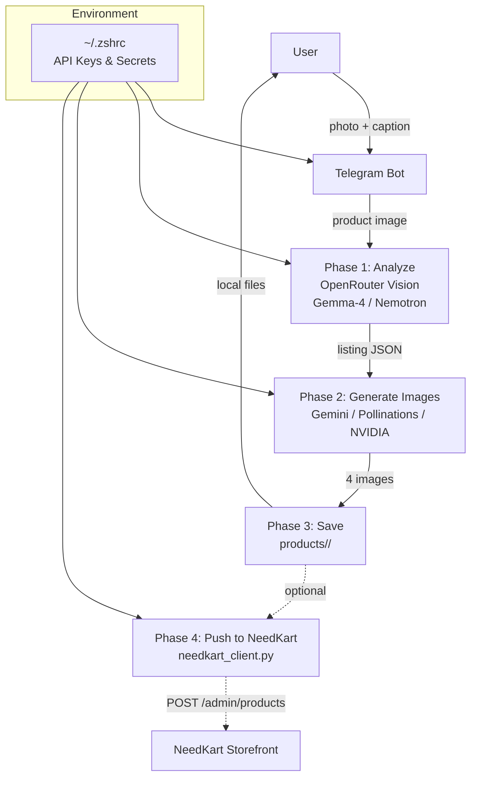

# EcomListing Pro

An AI-powered e-commerce product listing agent for Indian marketplaces (Amazon.in, Flipkart, Meesho). Generates complete, platform-compliant product listings from a single product image — including 4 AI-generated conversion-optimized images.

---

## Architecture



## Features

- **Vision-based product analysis** — identifies category, brand, features, audience from a single photo
- **50+ listing fields** — title, bullets, description, MRP, HSN, GST, dimensions, certifications, backend keywords
- **Platform-specific outputs** — separate optimized listings for Amazon.in, Flipkart, Meesho
- **4 AI-generated images** — lifestyle/use-case, before & after, how-to-use, enhanced hero shot
- **Telegram bot interface** — send a photo, get back a complete listing
- **NeedKart integration** — auto-publish products to your Medusa store (when credentials configured)
- **Product hint support** — caption your photo with product name/details for better results

## File Structure

```
ecommerce-agent/
├── listing_agent.py        # Core agent — analyze, generate images, save
├── telegram_bot.py         # Telegram bot interface
├── needkart_client.py      # NeedKart admin API client (login, upload, create product)
├── ecommerce.md            # Full agent specification & prompt templates
├── sofar.md                # Progress documentation
├── products/               # Generated listings (git-tracked)
│   ├── shoe-shine-wipes/
│   ├── kids-toothbrush-set/
│   └── ...
└── README.md
```

## Setup

### Prerequisites

- Python 3.10+
- A Telegram Bot Token (from [@BotFather](https://t.me/BotFather))
- An OpenRouter API key (or OpenAI-compatible endpoint)

### Installation

```bash
git clone https://github.com/shafeequealipt-dotcom/Ecommerce_Agent.git
cd Ecommerce_Agent
pip install python-telegram-bot
```

### Environment Variables

Add these to `~/.zshrc` (or your shell profile):

```bash
# Required
export OPENROUTER_API_KEY="sk-or-v1-..."
export TELEGRAM_BOT_TOKEN="123456:ABC-..."

# Image generation (at least one)
export NVIDIA_API_KEY="nvapi-..."           # FLUX models — slow but free(ish)
export DE_API_KEY="13263|..."                # FLUX.2-klein img2img — best quality, rate-limited free tier

# NeedKart integration (optional)
export NEEDKART_API_BASE="https://api.staging.needkart.store"
export ADMIN_EMAIL="admin@store.com"
export ADMIN_PASSWORD="..."
```

Source and verify:

```bash
source ~/.zshrc
```

## Usage

### CLI

```bash
# Basic
python3 listing_agent.py /path/to/product-photo.jpg

# With product hint + specify image model
python3 listing_agent.py --hint "Blue running shoes, size 9" --image-model gemini /path/to/photo.jpg

# Push to NeedKart after generation (requires valid admin credentials)
python3 listing_agent.py --push /path/to/photo.jpg
```

### Telegram Bot

```bash
python3 telegram_bot.py
```

Then open Telegram and message your bot:

1. Send a clear product photo
2. Add a **caption** with the product name/details (optional but recommended)
3. Wait 2–5 minutes
4. Receive: `listing.json`, platform-specific files, and 4 images

Commands:

| Command | Description |
|---|---|
| `/start` | Welcome message |
| `/help` | Usage guide |
| `/model <name>` | Switch image model: `gemini`, `pollinations`, `nvidia`, `deapi` |

## Pipeline

```
Phase 1 — Analyze
─────────────────
Input:  product image + optional hint
Model:  google/gemma-4-31b-it:free  →  gemma-4-26b  →  nemotron-nano-12b-vl
Output: listing JSON (50+ fields)

Phase 2 — Generate Images
───────────────────────────
Input:  image prompts from listing JSON
Models: Gemini (default)  →  Pollinations  →  NVIDIA FLUX  →  deAPI.ai
Output: 4 x 1024×1024 images (lifestyle, before/after, how-to, hero)

Phase 3 — Save
────────────────
Output: products/<slug>/listing.json + platform texts + images

Phase 4 — Push to NeedKart (optional)
────────────────────────────────────────
         login → upload images → create product → set inventory
```

## NeedKart Integration

The `needkart_client.py` module provides a full admin API client:

| Method | Endpoint | Purpose |
|---|---|---|
| `login()` | `POST /auth/user/emailpass` | Admin JWT auth |
| `upload_image()` | `POST /admin/uploads` | Upload product images |
| `create_product()` | `POST /admin/products` | Create product with all fields |
| `set_inventory()` | `POST /admin/inventory-items/{id}/location-levels` | Set stock at warehouse |
| `publish_listing()` | Full pipeline | Login → upload → create → set stock |

The integration is **ready but not active** — pending valid staging admin credentials.

## Image Generation Models

| Model | Quality | Speed | Cost | Status |
|---|---|---|---|---|
| **Gemini** (OpenRouter) | High | Medium | Paid | ✅ Default |
| **NVIDIA FLUX** | High | Slow | Free | ⚠️ Timeouts |
| **deAPI.ai FLUX.2** | High | Fast | Free | ⚠️ Rate-limited |
| **Pollinations.ai** | Medium | Fast | Free | ✅ Always works |

## Pending Improvements

- [ ] Confirm staging admin password → enable NeedKart auto-publish
- [ ] Add OpenRouter credits for faster Gemini image generation
- [ ] Reduce retry delays on rate-limited models
- [ ] Add support for multiple photos (batch processing)
- [ ] Add analytics / listing preview in Telegram
- [ ] Multi-language listings (Hindi, Hinglish for Meesho)
